Github地址: 

# 作业1

## 代码链接：
https://github.com/shallow1999/final
## 网盘链接：
链接：https://pan.baidu.com/s/1p_BY72xXTgJCMwQcR0NUBg 
提取码：84u5

# 作业2

## 模型网盘链接：
链接: https://pan.baidu.com/s/14JTg_P2e6az0G40CGX5xIQ 提取码: 6ul9 
--来自百度网盘超级会员v3的分享
## 数据集介绍
本项目按要求使用VOC数据集，该数据集是目标检测中常用数据，其中以2007和2012的数据最为常用，本项目就选用了2007和2012的数据作为训练集，包含共16551张图片及其中目标物体的类别（共20类）和边界框位置；测试集为2007年数据中给出的4952张测试图片。其余涉及的ImageNet和coco数据集均为直接使用检索到的预训练结果。

## 网络结构
作业2中三个任务都是使用Faster R-CNN模型，网络结构一致，不同点在于部分参数的初始化方式不同。
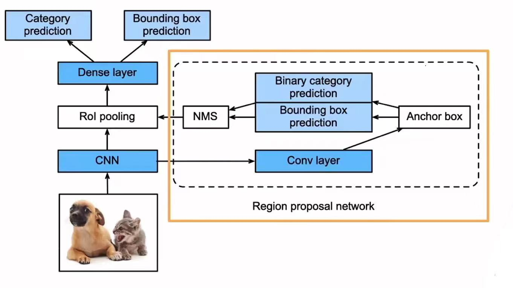
如图所示，Faster R-CNN一般在将输入的图片进行一定的大小转换后，进入backbone网络（ResNet50+FPN）提取feature maps，然后进入RPN网络进行proposals的选取（包含判断Anchor是否positive以及其所需的偏移量）。然后RoI池化层整合feature maps和proposal boxes的信息，得出proposal的feature map，最后进入全连接层进行最终的分类以及Bounding box回归，得到最终的预测框。

## Loss function
$L\left(\left\{p_{i}\right\},\left\{t_{i}\right\}\right) =\frac{1}{N_{c l s}} \sum_{i} L_{c l s}\left(p_{i}, p_{i}^{*}\right)
+\lambda \frac{1}{N_{r e g}} \sum_{i} p_{i}^{*} L_{r e g}\left(t_{i}, t_{i}^{*}\right)$
其中第一部分是2个类别的分类损失（有无对象），第二部分是边界框的回归损失，即只有当有物体时才存在损失。

## 评价指标（mAP）
mAP (mean Average Precision)：各分类的AP（即PR曲线下面积）的平均值。其中目标检测中的PR曲线中Rrecision和Recall的定义与一般分类问题有所不同：
TP：该类别IoU（交并比）大于阈值的预测框数量（同一真实边界框只计算一次）
FP：该类别IoU小于阈值的预测框数量加上检测到同一真实边界框的多余预测框数量
FN：该类别没有检测到的真实边界框的数量
注：mAP的计算中无TN
Precision=TP/(TP+FP)
Recall=TP/(TP+FN)


## 实验及结果

### 随机初始化
#### 参数设定及优化器选择
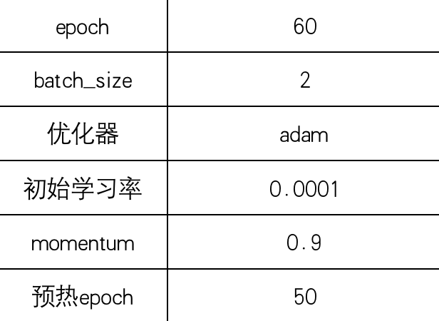

#### 实验结果可视化
训练和测试的loss曲线分别如下
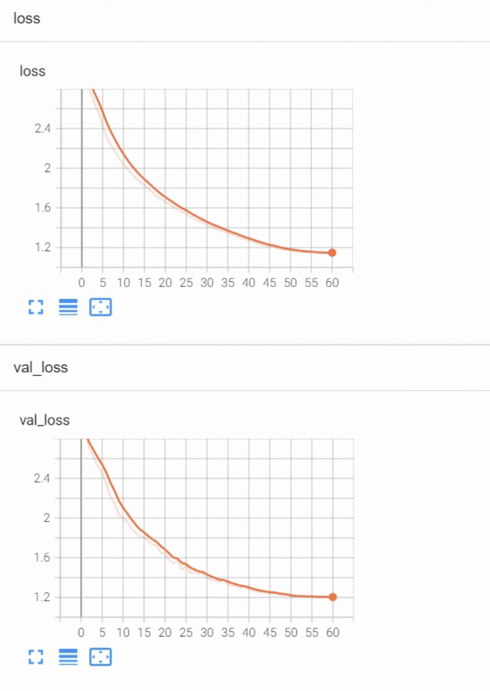

测试mAP曲线如下（阈值：0.5，每5个epoch收集一次mAP，共12个数据点）
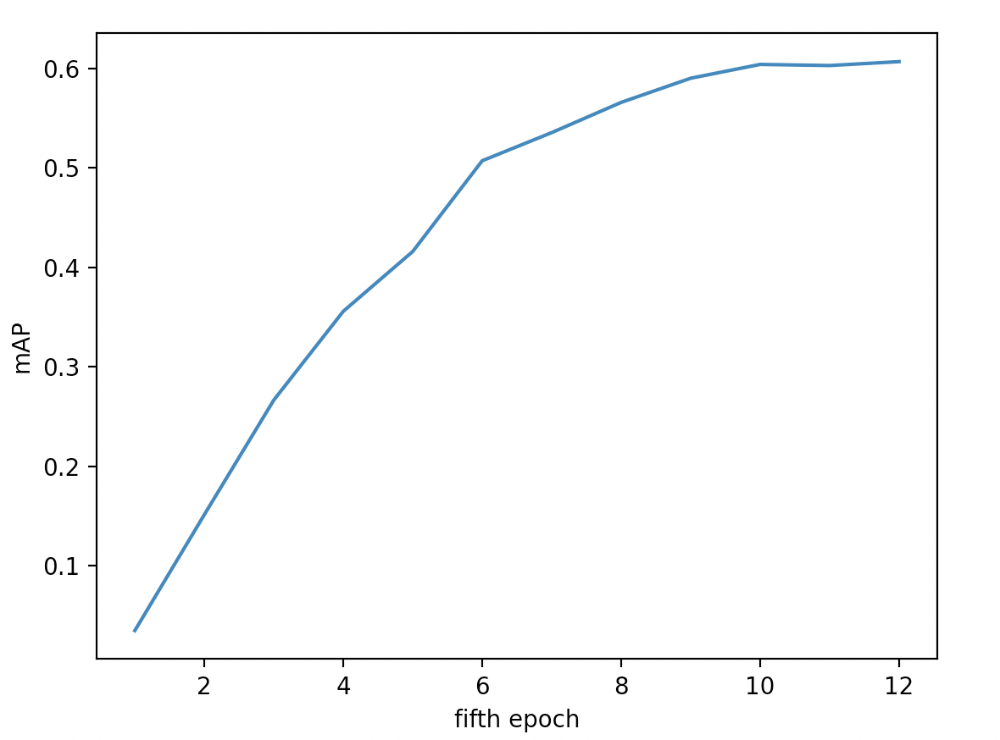


### ImageNet预训练模型fine tune
#### 参数设定及优化器选择
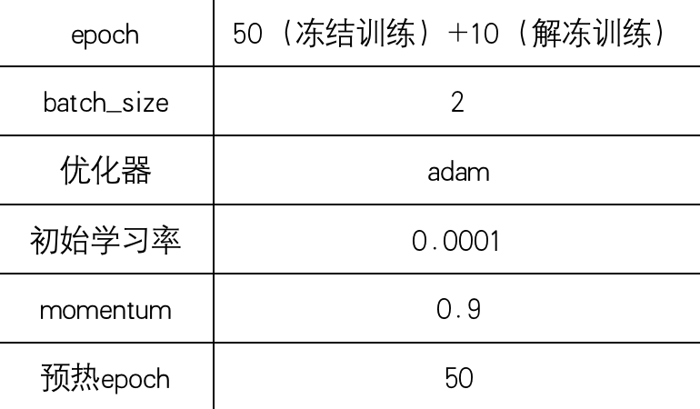
#### 实验结果可视化
训练和测试的loss曲线分别如下
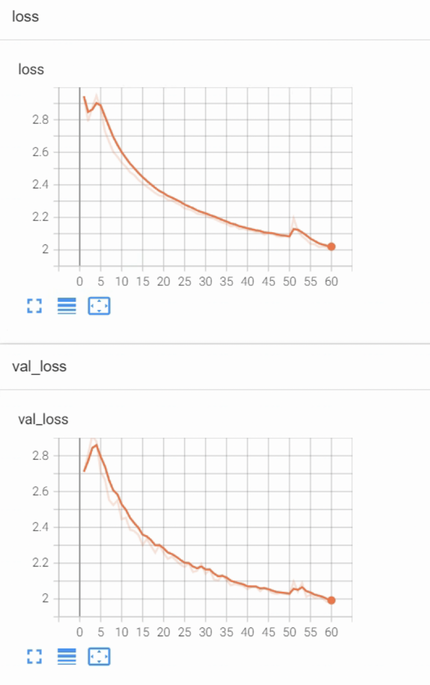
测试mAP曲线如下（阈值：0.5，每5个epoch收集一次mAP，共12个数据点）
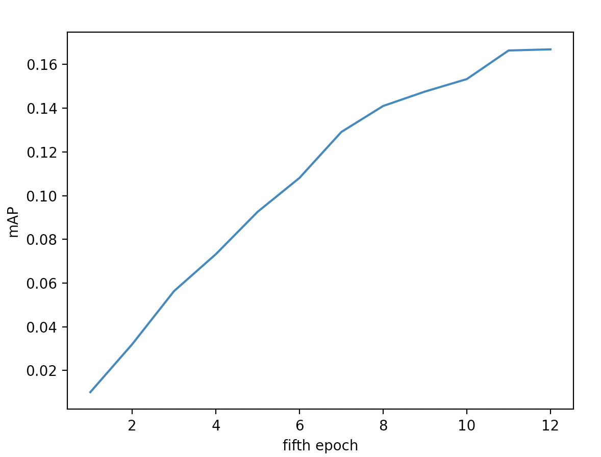

### coco预训练Mask R-CNN模型fine tune
#### 参数设定及优化器选择

#### 实验结果可视化
训练和测试的loss曲线分别如下
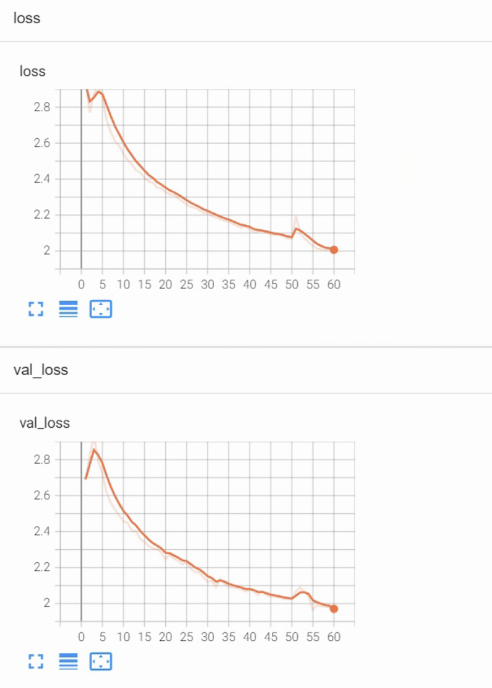
测试mAP曲线如下（阈值：0.5，每5个epoch收集一次mAP，共12个数据点）
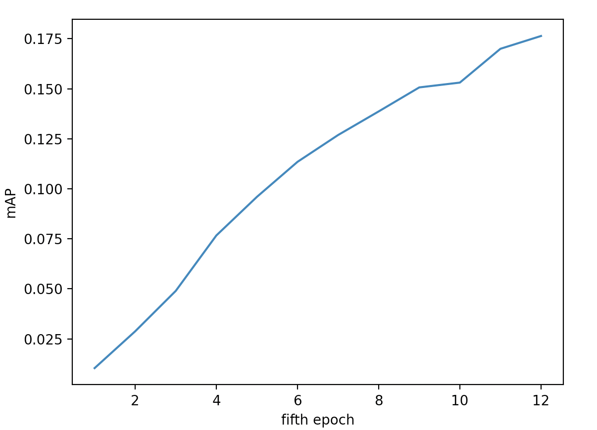


# 作业3

### Transformer 模型: VIT


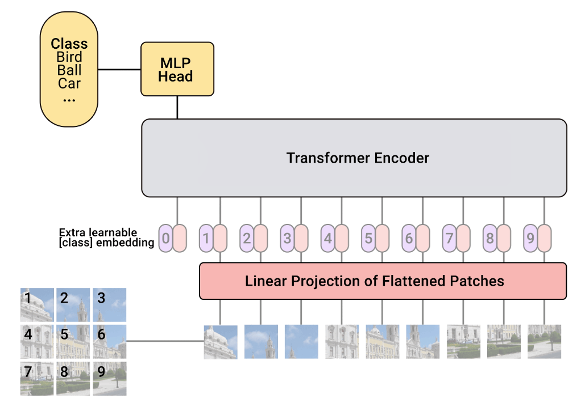

我们使用VIT模型进行对比，模型参数如下:

```python
from vit_pytorch import ViT
net = ViT(
    image_size = 32,
    patch_size = 16,
    num_classes = 100,
    dim = 512,
    depth = 4,
    heads = 16,
    mlp_dim = 1024,
    dropout = 0,
    emb_dropout = 0.1
).to("cuda:0")
```

| 模型         | 参数量   |
| ------------ | -------- |
| Resnet18     | 11220132 |
| VIT          | 13048420 |
| VIT/Resnet18 | 1.16     |

### Accuracy对比


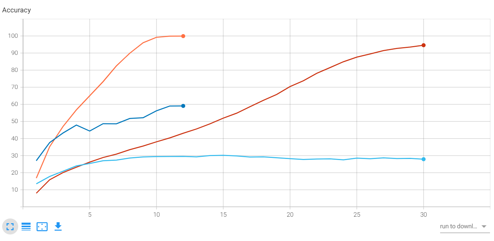

### Loss对比


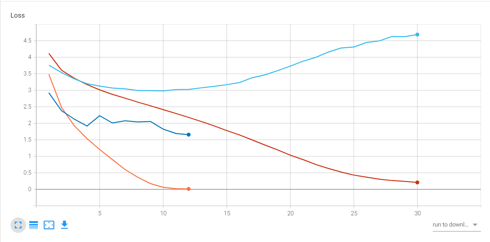

